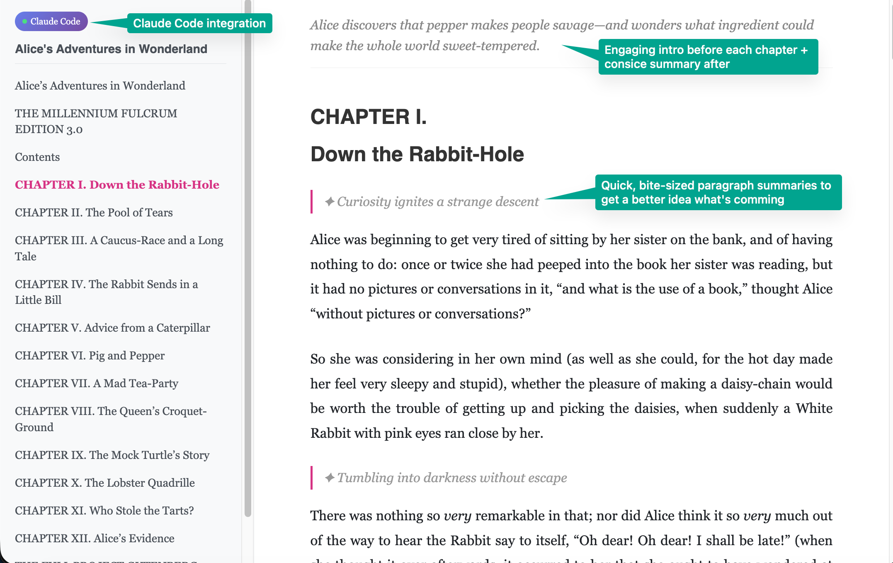

# reader 3



A lightweight, self-hosted EPUB reader that lets you read through EPUB books one chapter at a time. This makes it very easy to copy paste the contents of a chapter to an LLM, to read along. Basically - get epub books (e.g. [Project Gutenberg](https://www.gutenberg.org/) has many), open them up in this reader, copy paste text around to your favorite LLM, and read together and along.

This project was 90% vibe coded just to illustrate how one can very easily [read books together with LLMs](https://x.com/karpathy/status/1990577951671509438). I'm not going to support it in any way, it's provided here as is for other people's inspiration and I don't intend to improve it. Code is ephemeral now and libraries are over, ask your LLM to change it in whatever way you like.

## Simple Usage

The easiest way to use the reader:

```bash
 uv run book.py alice.epub
```

This will:
1. Process the EPUB file and extract all content, images, and metadata
2. Start the server automatically
3. Open the book at [localhost:8123](http://localhost:8123/)

You can run it again with a different book, and the previous one will be replaced. Press `Ctrl+C` to stop the server.

## Advanced Usage

The project uses [uv](https://docs.astral.sh/uv/). For manual control over processing and serving:

```bash
uv run reader3.py dracula.epub
```

This creates the directory `dracula_data` with the processed book. Then run the server separately:

```bash
uv run server.py
```

And visit [localhost:8123](http://localhost:8123/). You can easily add more books, or delete them from your library by deleting the `*_data` folder. It's not supposed to be complicated or complex.

## License

MIT